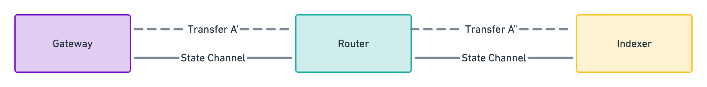
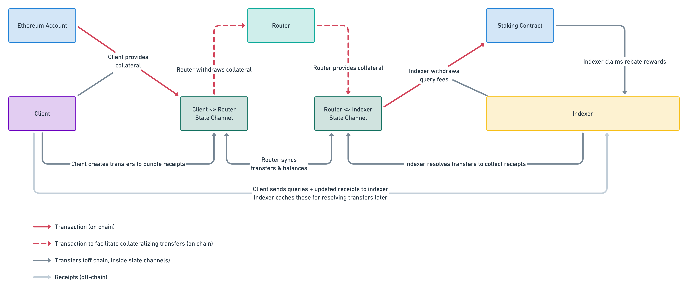
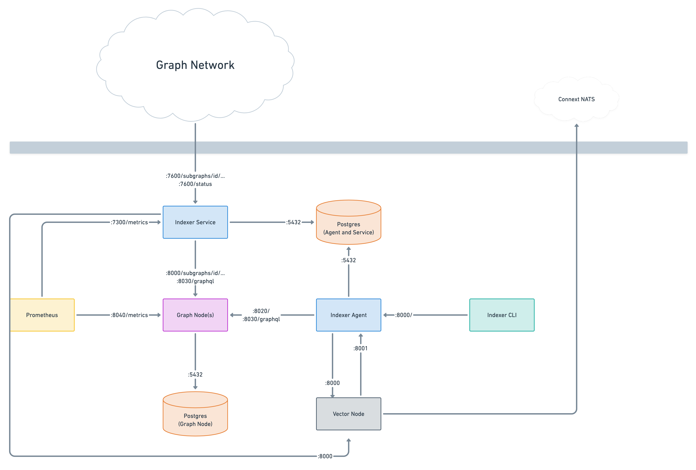

# Scalar Overview

[Blog post introducing Scalar](http://thegraph.com/blog/scalar).

## What is Scalar?

Scalable microtransactions for query fees based on Connext's Vector state
channels framework. It consists of multiple layers, with each layer building
on top of the one below.

## Nomenclature

- **Receipt** — An aggregation of off-chain query fee transactions between a
  client and indexer that were made when querying a specific subgraph
  deployment.

- **Transfer** — Aggregates **receipts** between a client and indexer for a
  specific subgraph deployment. Transfers are created to collateralize the
  query fee transactions included in the receipts, and are executed (Connext:
  "resolved") when an indexer decides to collect the corresponding receipts.
  Usually, this happens when the indexer closes an allocation they created
  against the same subgraph deployment. When a transfer is resolved, the
  balances of the two participants in the state channel are updated: the
  balance of the client is decreased, the balance of the indexer increased.
  This is taking place off-chain.

- **State Channel** — A persistent relationship established between client
  and router or router and indexer.

## Participants

Scalar involves three participants:

- **Client** — Sends queries to indexers. Each query comes with updated
  receipt data that includes the latest query fees.

- **Indexer** — Receives queries with receipt data from clients and stores
  copies of these receipts in its database. When it closes subgraph
  allocations, it resolves transfers for the allocation. This updates their
  balance in the state channel. Once all transfers are resolved, the indexer
  withdraws this amount from the state channel into staking contract, where the
  query fees are ultimately distributed via a rebate pool.

- **Router** — A component that acts as a bridge between client and indexer
  when it comes to managing and collateralizing state channels and transfers.
  Future plans include transforming this into a network of routers.

## State Channels & Transfers

A state channel is always created between a client and router or indexer and
router. There are no direct state channels between clients and indexers.

Transfers are created between a client and an indexer. However, for every
transfer A, there really exist two transfers A' (in the client <> router
state channel) and A'' (in the router <> indexer state channel). Whenever a
transfer is resolved, both the client <> router state channel balances and
the router <> indexer state channel balances are updated in the same way.

Let's say the state channel balances are as follows:

- Client <> Router channel: client = 10, router = 0
- Router <> Indexer channel: router = 20, indexer = 0

When a transfer with two receipts (5 GRT and 1 GRT, total of 6 GRT) is
resolved, the state channel balances are updated to the following values:

- Client <> Router channel: client = 4, router = 6
- Router <> Indexer channel: router = 14, indexer = 6

## Overall Query Fee Flow

## Changes To The Indexer Infrastructure

The introduction of Scalar adds a new component, a Vector node, to the
indexer infrastructure. This component manages the indexer’s state channel
and is used by Indexer Service and Indexer Agent to look up transfers,
resolve transfers and withdraw query fees through the staking contract.

Overview of the changes:

- The `/channel-messages-inbox` endpoint of Indexer Service is removed.
- A new Vector node component is introduced.
- Indexer Service uses port 8000 of the Vector node to look up transfers.
- Indexer Agent uses port 8000 of the Vector node to:
  - Look up transfers
  - Resolve transfers
  - Withdraw query fees through the staking contract
  - Subscribe to transfer events

Vector node needs its own Postgres database to keep its data separate from
indexer data such as indexing rules or cost models.
